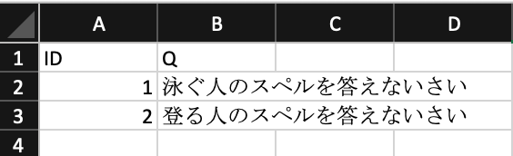
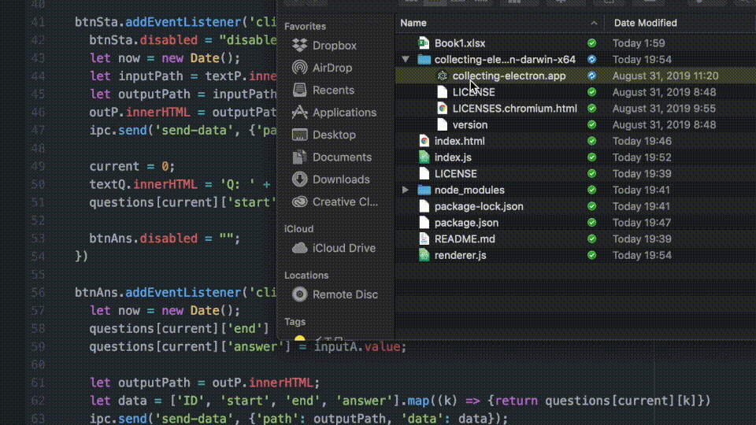

# collecting-electron
This is an electron application to collect examination information.

## How to Use

### Preparation

You have to prepare a excel file that has `ID` and `Q` headers.




### Demo



### Output

An output file is like below,

```
ID,start,end,answer
1,20190809-195719.573,20190809-195721.705,aaa
2,20190809-195721.706,20190809-195724.189,bbb
```
