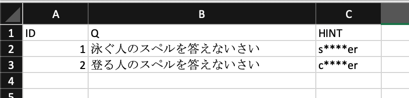
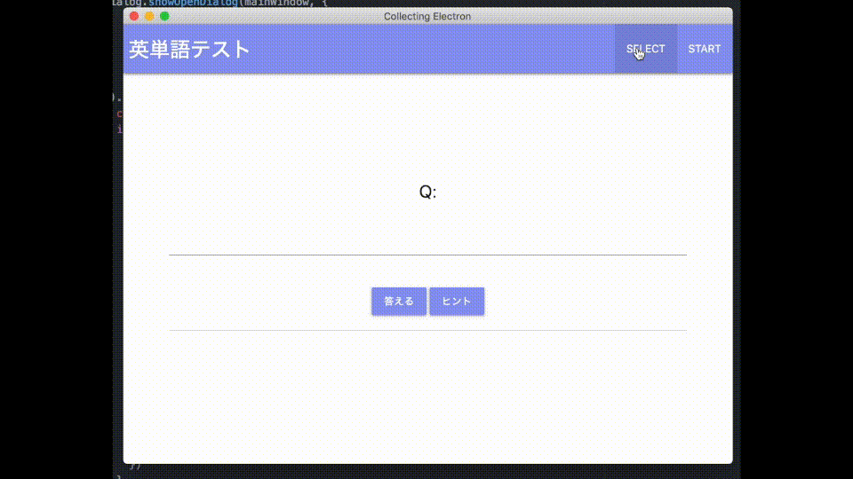

# collecting-electron
This is an electron application to collect examination information.

## How to Use

### Preparation

You have to prepare a excel file that has `ID`, `Q`, and `HINT` headers.




### Demo



### Output

An output file is like below,

```
ID,start,first-focusin,hint,end,answer
1,20190816-163910.541,20190816-163916.141,20190816-163928.554,20190816-163944.775,swimmer
2,20190816-163944.776,20190816-163949.130,,20190816-163958.303,climber
```

## How to Build

```
npm install -g electron-packager
npm install .
electron-packager . --electronVersion=6.0.7 --overwrite --out out --ignore data
```
